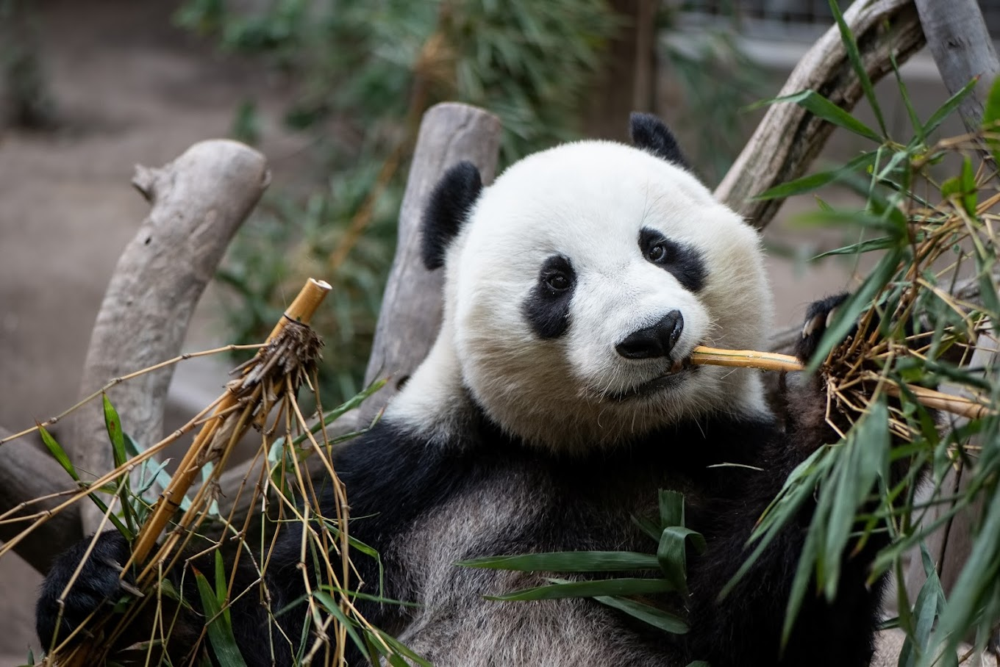
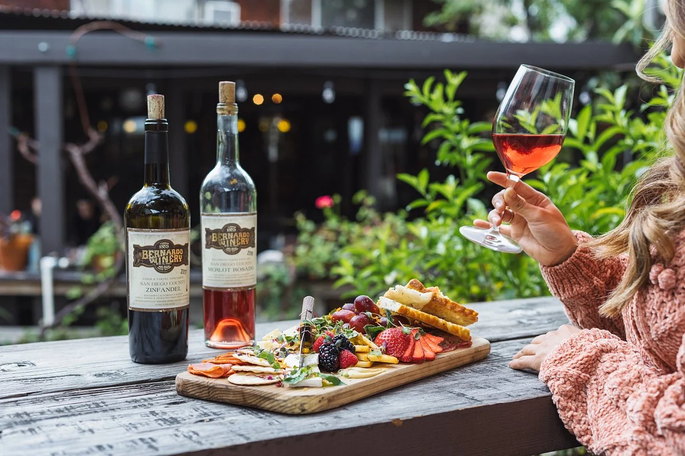

Here are some activities in San Diego:

<!--- <form id="activityForm">
    <label for="activityType">Activities:</label>
    <select id="activityType" name="activityType" required>
        <option value="familyfriendly.html">Family Friendly</option>
        <option value="adult.html">Adult</option>
        <option value="indoor.html">Indoor</option>
        <option value="outdoor.html">Outdoor</option>
    </select>  
</form>
--->

<a href="/CPT-project/_posts/familyfriendly.html">
    <h1>Family Friendly</h1>
    
</a>  

<a href="/CPT-project/_posts/adult.html">
    <h1>Adult</h1>
    
</a>  

<a href="/CPT-project/_posts/indoor.html">
    <h1>Indoor</h1>
    
</a>  

<a href="/CPT-project/_posts/outdoor.html">
    <h1>Outdoor</h1>
    
</a>  

