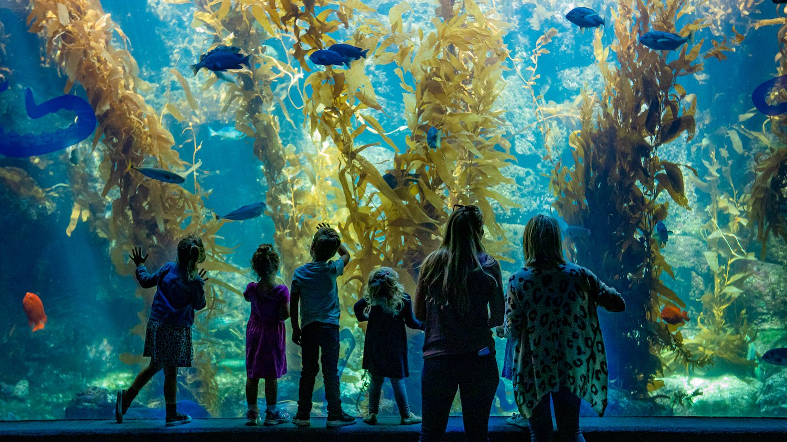
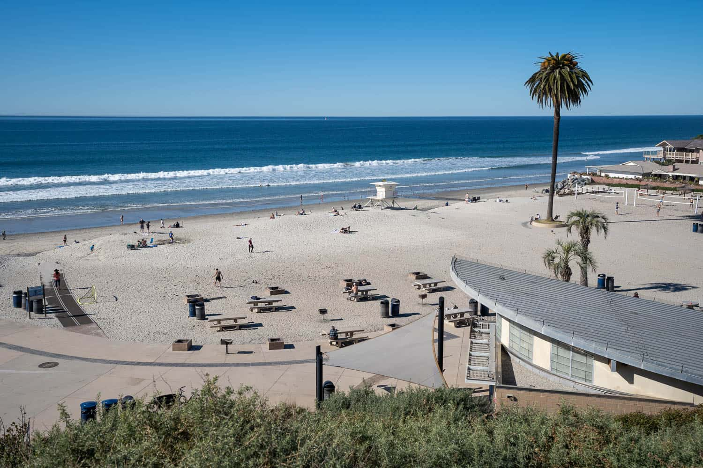

Here are some activities in San Diego:

<form id="activityForm">
        <label for="activityType">Activities:</label>
        <select id="activityType" name="activityType" required>
            <option value="Family Friendly">Family Friendly</option>
            <option value="Adult">Adult</option>
            <option value="Indoor">Indoor</option>
            <option value="Outdoor">Outdoor</option>
        </select>  
</form>

<a href="familyfriendly.html">
    <h1>Family Friendly</h1>
    
</a>  

<a href="adult.html">
    <h1>Adult</h1>
    
</a>  

<a href="indoor.html">
    <h1>Indoor</h1>
    
</a>  

<a href="outdoor.html">
    <h1>Outdoor</h1>
    
</a>  